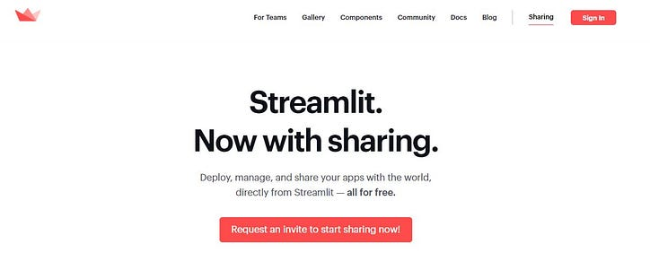
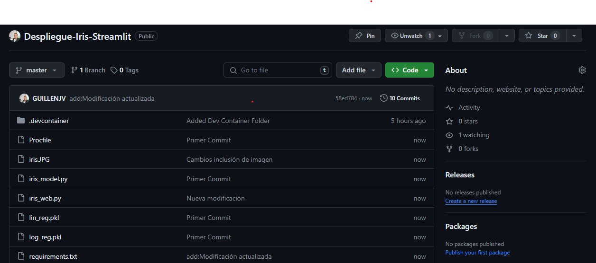
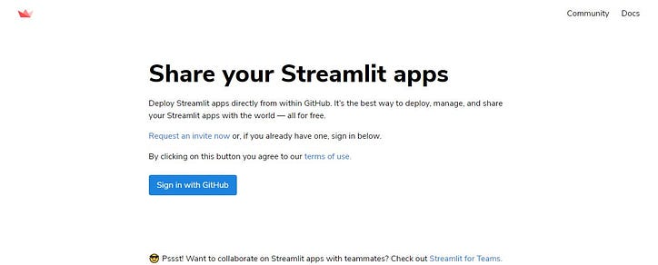
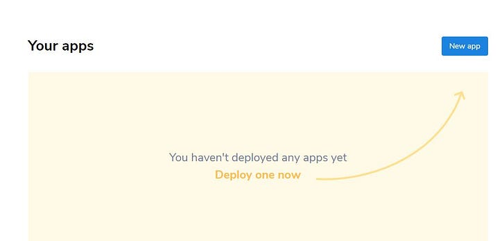
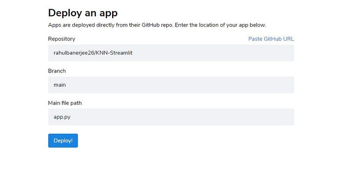

# Iris-Streamlit

¿Qué es Streamlit y por qué es útil?
Streamlit es un marco de Python de código abierto para crear aplicaciones web para aprendizaje automático y ciencia de datos. Este marco facilita a los científicos de datos y los ingenieros de aprendizaje automático la creación de potentes interfaces de usuario que interactúan con los modelos de aprendizaje automático.

Hasta la llegada de Streamlit, Flask y Django eran las bibliotecas goto que los desarrolladores optaban por utilizar para desarrollar e implementar su aplicación en la web ; sin embargo, ambos marcos requerían que el usuario escribiera código HTML / CSS para representar su trabajo como una aplicación web. Streamlit abstrae todo esto y proporciona una interfaz pitónica fácil para agregar componentes personalizados como controles deslizantes, menús desplegables, formularios, etc.


# Implemente su aplicación web de aprendizaje automático mediante Streamlit Sharing

Hay dos opciones sencillas si desea implementar su aplicación web: utilizando Heroku o Streamlit sharing. El problema con Heroku es que si solo tiene acceso de nivel gratuito, limitarán el tamaño de su slug a alrededor de 500 MB. Mientras tanto.

Por eso, usemos el uso compartido de Streamlit para implementar la aplicación. Es muy fácil implementar su aplicación web Streamlit con el uso compartido de Streamlit. A continuación, se muestra paso a paso cómo puede implementar su aplicación web:

Lo primero que debe hacer es solicitar una invitación para compartir Streamlit. Puede hacerlo accediendo a esta página . Todo lo que necesita hacer es ingresar su nombre y el correo electrónico que usa para su cuenta de GitHub. Si no recuerda su correo electrónico, puede hacerlo iniciando sesión en su cuenta de GitHub, luego vaya a Configuración. En la Configuración, seleccione Correos electrónicos y verá su dirección de correo electrónico.
A continuación, cree un repositorio en su GitHub que contenga tres archivos: el archivo Python para crear la aplicación web, el archivo pickle del modelo de clasificador que hemos creado y un archivo de texto llamado requirements.txt. Este archivo de texto debe contener todas las dependencias que necesitamos para crear nuestra aplicación.

# Obtenga acceso a Streamlit Sharing
A continuación, vaya a esta página e inicie sesión con su cuenta de GitHub.
Ahora debería ver la siguiente página después de iniciar sesión.



# Crea un archivo de texto con las bibliotecas necesarias
Cree un archivo requirements.txt con las dependencias. A continuación se muestra el comando para crear el archivo

```python
pip freeze > requirements.txt
```
#Sube los archivos a GitHub
Cree un repositorio PÚBLICO en GitHub y cargue los archivos .py y el archivo requirements.txt.



# Iniciar sesión en Streamlit Sharing
Vaya al siguiente sitio web e inicie sesión con su cuenta de GitHub.



Autoriza Streamlit y dale acceso a tus repositorios de Github.

# Crea una nueva aplicación



Haga clic en Nueva aplicación



Seleccione su repositorio y rama. En mi caso, es la rama maestra del repositorio llamada 'Despliegue-Iris-Streamlit'

La ruta del archivo principal debe contener la ruta a su archivo app.py o el archivo .py que tiene el código para la IU de Streamlit. Si su archivo app.py está dentro de una carpeta llamada 'app', la ruta será 'app / app.py'. Asegúrese de proporcionar la ruta correcta. Una vez que haya completado la información correcta, haga clic en Implementar.

Ahora siéntate y relájate ☺️

Una vez que se complete la implementación, recibirá un mensaje de éxito y podrá ver una demostración de su aplicación.

https://despliegue-iris-app-d8asmzy4y44jrgf5ksldth.streamlit.app/


